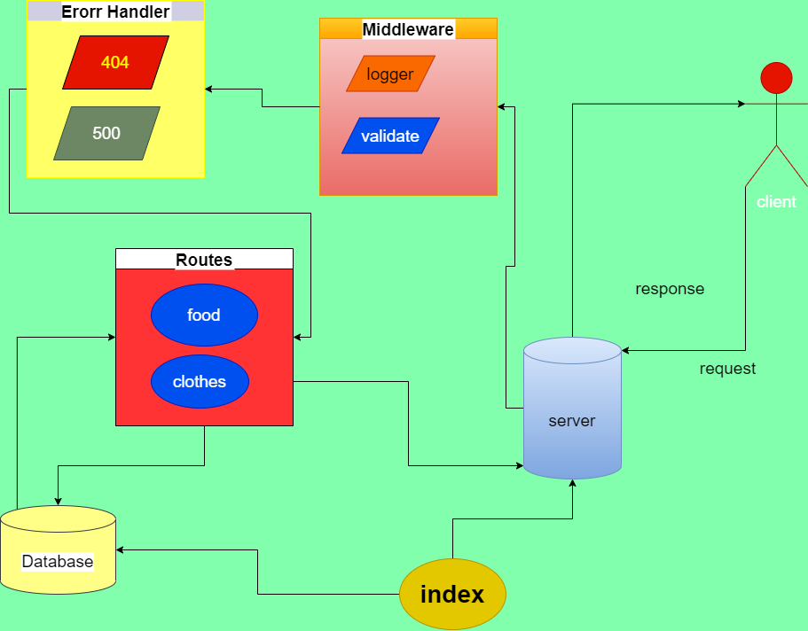

# Basic Api Server
### A REST Express API, has verious end points that perform CRUD operations, on a postgres database, using REST standerds.

### Feature Requierments
* Creating two Routes ( food & clothes).
* Reading data from that routes. (get:` /food`)
* Adding Data for that routes. (post: ` /food`)
* Update data (put: `/food/:id`)
* Delete data (delete: `/food/:id`)
* Response body: JSON

## Deployment

### [Action](https://github.com/amr88nzzal/basic-api-server/actions)

### [Heroku](https://amr-basic-api-server.herokuapp.com/) 

### [Pull Requests](### [Action](https://github.com/amr88nzzal/basic-api-server/pulls)

***

### UML Diagram

